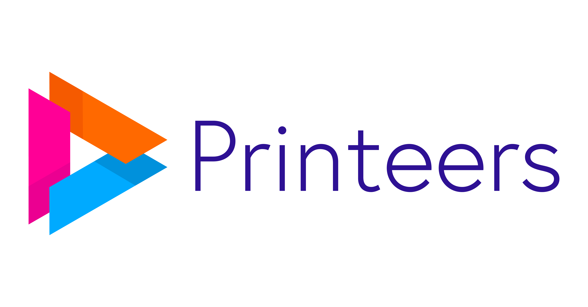

Hoi, wij zijn [Printeers](https://printeers.com/)

## Printeers in het kort

- Printeers is een snelgroeiende en jonge scale-up in on-demand productpersonalisatie.
- Highly-available systemen in 'de cloud' en on-premise.
- We werken met [cloud-native](https://landscape.cncf.io/) technieken
- DevOps insteek: je beheert wat je zelf bouwt.
- Hybrid werken: op [HQ in Alkmaar](https://www.google.com/maps/place//data=!4m2!3m1!1s0x47cf568924877e31:0x1799d76d190b3c51?hl=en-GB) en vanuit huis.

Wij printen miljoenen producten voor honderden webshops wereldwijd. Op die manier maken we mensen blij met hoogwaardige en unieke accessoires, zoals bijvoorbeeld een telefoonhoesje met gepersonaliseerde opdruk.

Dat doen we door, vanuit onze productiefaciliteit in Alkmaar, 7 dagen per week te produceren en verzenden. Om de kwaliteit hoog en de time-to-delivery laag te houden gebruiken we moderne printtechnieken en natuurlijk een goede dosis automatisering.

## Jouw toekomst?

- Ontwerp, bouw en draai backend applicaties in een moderne microservice architectuur. We blijven onze stack continu vernieuwen en up-to-date houden en focussen op highly-available en schaalbare systemen.
- We moedigen nieuwsgierigheid aan. Er is ruimte om nieuwe technieken aan te dragen en te testen. Technieken met toegevoegde waarde adopteren we graag.
- Werk samen met onze andere engineers aan functionele, technische en operationele designs, en werk deze uit tot een eindproduct dat door je collega's op de productievloer en door onze klanten gebruikt wordt.
- Bij DevOps hoort ook verantwoordelijkheid. Als engineer bij Printeers ben je verantwoordelijk voor de componenten waar je 'owner' van bent.
- Ontwikkel je skills en werk aan toffe projecten. En dat alles met een gezellig team van getalenteerde collega's.

## De sollicitatieprocedure

**Kennismaking**

We maken kennis op onze locatie in Alkmaar.

**Coding challenge**

We vragen je om een technische challenge te doen in Go. Lees meer over [de technische coding challenge](./coding-challenge/challenge.md).

**Technisch interview**

In een technisch interview kijken we naar de gemaakte challenge en gebruiken we dat als basis om  te sparren over Go, Postgres en andere technieken.
  
## Geïnteresseerd?

Kijk eens op onze **[carrièrepagina](https://printeers.com/about/careers/)** om te zien welke rollen er momenteel open staan en stuur ons een bericht!

Het lijkt ons leuk om kennis te maken!

